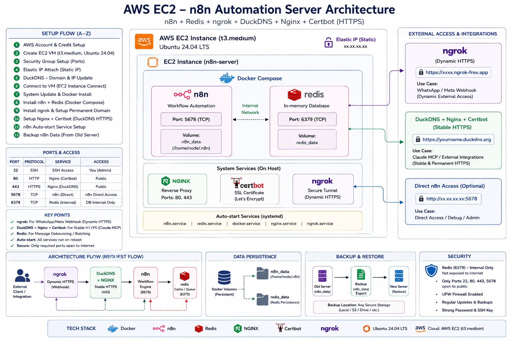

<!--
SEO Keywords: AWS EC2 n8n self-hosted, n8n AWS setup guide, self-hosted n8n Docker,
n8n Redis Docker Compose AWS, ngrok n8n webhook, DuckDNS Nginx Certbot n8n,
n8n Elastic IP AWS, n8n workflow automation server AWS, Ubuntu 24.04 n8n Docker,
Gmail OAuth2 n8n fix, n8n backup restore, auto-start n8n systemd, AutomateIQ Labs,
n8n WhatsApp webhook ngrok, self-hosted workflow automation AWS EC2
-->

<div align="center">


[](https://aws.amazon.com)
[](https://ubuntu.com)
[](https://n8n.io)
[](https://docker.com)
[](https://redis.io)
[]()

<br/>

[](https://git.io/typing-svg)

<br/>

> **A complete step-by-step guide to self-hosting n8n on AWS EC2 — with Redis, Elastic IP, two HTTPS options (ngrok or DuckDNS), auto-start system, backup and Gmail OAuth2 fix.**

</div>

---

## 📌 Table of Contents

- [🏗️ Architecture](#️-architecture)
- [🛠️ Stack](#️-stack)
- [✅ Prerequisites](#-prerequisites)
- [Part 1 — AWS Account Setup](#part-1--aws-account-setup)
- [Part 2 — Create EC2 VM](#part-2--create-ec2-vm)
- [Part 3 — Elastic IP (Static IP)](#part-3--elastic-ip-static-ip)
- [Part 4 — Security Group (Ports)](#part-4--security-group-ports)
- [Part 5 — Connect to VM](#part-5--connect-to-vm)
- [Part 6 — System Update & Docker](#part-6--system-update--docker)
- [Part 7 — n8n + Redis (Docker Compose)](#part-7--n8n--redis-docker-compose)
- [Part 8 — HTTPS Option A: ngrok](#part-8--https-option-a-ngrok)
- [Part 9 — HTTPS Option B: DuckDNS + Nginx + Certbot](#part-9--https-option-b-duckdns--nginx--certbot)
- [Part 10 — Auto-Start System](#part-10--auto-start-system)
- [Part 11 — n8n Backup & Restore](#part-11--n8n-backup--restore)
- [Part 12 — Gmail OAuth2 Fix](#part-12--gmail-oauth2-fix)
- [⚡ Quick Reference](#-quick-reference)
- [🔍 Useful Debug Commands](#-useful-debug-commands)
- [🔧 Troubleshooting](#-troubleshooting)
- [👤 Author](#-author)

---

## 🏗️ Architecture



### Layer Overview

| Layer | Components |
|---|---|
| **External** | Browser/User · WhatsApp/Meta Webhook |
| **HTTPS Options** | Option A: ngrok tunnel · OR · Option B: DuckDNS + Nginx + Certbot |
| **Network** | Elastic IP (Static) · AWS Security Group |
| **Docker** | n8n `:5678` · Redis `:6379` (internal) · Nginx `:80/:443` |
| **System** | systemd auto-start for Docker, n8n-compose, ngrok |

---

## 🛠️ Stack

| Component | Version / Detail | Purpose |
|---|---|---|
| **AWS EC2** | t3.medium — 2 vCPU, 4 GB RAM, 25 GB gp3 | Cloud server |
| **Ubuntu** | 24.04 LTS | Operating system |
| **Docker + Compose** | Latest stable | Container runtime |
| **n8n** | `n8nio/n8n` (latest) | Workflow automation engine (:5678) |
| **Redis** | `redis:7-alpine` | Message queue / cache (:6379 internal) |
| **Elastic IP** | AWS static IP | IP never changes on stop/start |
| **ngrok** | Static domain | Option A — free HTTPS tunnel, WhatsApp webhooks |
| **DuckDNS** | Free dynamic DNS | Option B — permanent subdomain |
| **Nginx** | Latest stable | Option B — reverse proxy (:80/:443 → :5678) |
| **Certbot** | Let's Encrypt | Option B — free SSL/TLS, auto-renew |

---

## ✅ Prerequisites

- A valid **credit/debit card** (AWS account verification)
- A **Google or GitHub account** (for ngrok and DuckDNS login)
- A **local machine** with a browser
- Basic comfort with copy-pasting terminal commands

---

## Part 1 — AWS Account Setup

1. Go to [aws.amazon.com](https://aws.amazon.com) → **"Create an AWS Account"**
2. Enter your **email, password, and account name**
3. Account type: **"Personal"**
4. Add a **payment method** (required for identity verification)
5. Complete phone verification
6. Support plan: **"Basic support — Free"**

### Set Region

After login, click the **region dropdown** (top-right) → select **"Asia Pacific (Mumbai) ap-south-1"**

> ✅ Mumbai region offers lower latency for South Asia.

---

## Part 2 — Create EC2 VM

### VM Configuration

| Setting | Value |
|---|---|
| **Name** | `n8n-server` |
| **OS / AMI** | Ubuntu Server 24.04 LTS (HVM), SSD Volume Type |
| **Instance Type** | `t3.medium` — 2 vCPU, 4 GB RAM |
| **Storage** | 25 GB gp3 |
| **Key Pair** | Create new — RSA, `.pem` format |

> ⚠️ Search for exactly **"Ubuntu Server 24.04 LTS (HVM), SSD Volume Type"** — avoid variants with "Pro", "SQL Server", or "Deep Learning".

### Steps

1. AWS Console → **EC2** → **"Launch Instance"**
2. Fill in the configuration above
3. **Key pair** → **"Create new key pair"** → download `.pem` file → **save safely** (cannot download again)
4. Network settings → ensure **"Allow SSH traffic"** is checked
5. Click **"Launch Instance"**
6. Wait for: Instance State = **"Running"** + Status Checks = **"✅ checks passed"**

---

## Part 3 — Elastic IP (Static IP)

Without Elastic IP, your VM's public IP changes every time you stop and start it — breaking your domain, ngrok config, and webhook URLs.

### Steps

1. AWS Console → **EC2** → **"Elastic IPs"** (left sidebar, under Network & Security)
2. Click **"Allocate Elastic IP address"** → **"Allocate"**
3. Select the newly created Elastic IP → **"Actions"** → **"Associate Elastic IP address"**
4. Select your EC2 instance → **"Associate"**

> ✅ Your VM now has a **permanent public IP** — it will not change when you stop/start the VM.
>
> ⚠️ Elastic IP is **free** while associated with a running instance. It costs if left unassociated.

---

## Part 4 — Security Group (Ports)

AWS Console → EC2 → Security Groups → your security group → **Edit inbound rules**

### Required Rules

| Type | Protocol | Port | Source | Purpose |
|---|---|---|---|---|
| SSH | TCP | 22 | 0.0.0.0/0 | Terminal access via key pair |
| HTTP | TCP | 80 | 0.0.0.0/0 | Nginx / Certbot SSL verification |
| HTTPS | TCP | 443 | 0.0.0.0/0 | HTTPS access (Option B) |
| Custom TCP | TCP | 5678 | 0.0.0.0/0 | n8n workflow engine |

Click **"Save rules"**.

> ✅ Port 6379 (Redis) does **not** need to be opened — it is internal only.

---

## Part 5 — Connect to VM

### Method 1 — Browser (Easiest)

1. EC2 → Instances → select your VM
2. Click **"Connect"** → **"EC2 Instance Connect"** tab → **"Connect"**
3. Terminal opens in browser ✅
4. Paste commands: **Ctrl + Shift + V**

### Method 2 — Windows CMD (SSH)

```cmd
ssh -i "C:\path\to\your-key.pem" ubuntu@[YOUR ELASTIC IP]
```

> If permission error on Windows, right-click `.pem` → Properties → Security → Advanced → set owner to your user only.

---

## Part 6 — System Update & Docker

```bash
# Update system
sudo apt update && sudo apt upgrade -y

# Install Docker
curl -fsSL https://get.docker.com | sh

# Add ubuntu user to docker group (no sudo needed)
sudo usermod -aG docker ubuntu

# Apply group change (re-login or run:)
newgrp docker

# Verify
docker --version
docker compose version
```

---

## Part 7 — n8n + Redis (Docker Compose)

### Step 1 — Create project directory

```bash
mkdir -p /home/ubuntu/n8n-compose
cd /home/ubuntu/n8n-compose
```

### Step 2 — Create docker-compose.yml

```bash
nano docker-compose.yml
```

Paste this configuration:

```yaml
services:
  n8n:
    image: n8nio/n8n
    container_name: n8n
    restart: always
    ports:
      - "5678:5678"
    environment:
      - N8N_SKIP_AUTH_ON_OAUTH_CALLBACK=true
      - WEBHOOK_URL=https://YOUR-DOMAIN-HERE
    volumes:
      - n8n_data:/home/node/.n8n
    depends_on:
      - redis

  redis:
    image: redis:7-alpine
    container_name: redis
    restart: always
    volumes:
      - redis_data:/data

volumes:
  n8n_data:
  redis_data:
```

> **WEBHOOK_URL** — set this to your HTTPS domain:
> - Option A (ngrok): `https://your-static-domain.ngrok-free.app`
> - Option B (DuckDNS): `https://your-subdomain.duckdns.org`

Save: `Ctrl+O` → `Enter` → `Ctrl+X`

### Step 3 — Start n8n + Redis

```bash
cd /home/ubuntu/n8n-compose
docker compose up -d
```

### Step 4 — Verify

```bash
docker ps
```

You should see both `n8n` and `redis` containers with status **"Up"**.

### Access n8n (HTTP — before HTTPS setup)

```
http://[YOUR ELASTIC IP]:5678
```

---

## Part 8 — HTTPS Option A: ngrok

> **When to use Option A:**
> - You need **WhatsApp / Meta webhook** support
> - You want a quick HTTPS URL without DNS setup
> - You can use both Option A and Option B simultaneously

### Step 1 — Install ngrok

```bash
curl -sSL https://ngrok-agent.s3.amazonaws.com/ngrok.asc \
  | sudo tee /etc/apt/trusted.gpg.d/ngrok.asc >/dev/null

echo "deb https://ngrok-agent.s3.amazonaws.com buster main" \
  | sudo tee /etc/apt/sources.list.d/ngrok.list

sudo apt update && sudo apt install ngrok -y
```

### Step 2 — Get Static Domain & Authtoken

1. Go to [ngrok.com](https://ngrok.com) → sign up / log in
2. Dashboard → **"Domains"** → **"Create Domain"** → copy your free static domain (e.g., `abc-xyz.ngrok-free.app`)
3. Dashboard → **"Your Authtoken"** → copy token

### Step 3 — Configure ngrok

```bash
ngrok config add-authtoken YOUR_AUTHTOKEN
```

### Step 4 — Test ngrok

```bash
ngrok http --domain=YOUR-STATIC-DOMAIN.ngrok-free.app 5678
```

You should see your n8n accessible at `https://YOUR-STATIC-DOMAIN.ngrok-free.app` ✅

Press `Ctrl+C` to stop test — next step makes it run automatically.

### Step 5 — Update WEBHOOK_URL in docker-compose.yml

```bash
cd /home/ubuntu/n8n-compose
nano docker-compose.yml
```

Update:
```yaml
- WEBHOOK_URL=https://YOUR-STATIC-DOMAIN.ngrok-free.app
```

Restart n8n to apply:
```bash
docker compose down && docker compose up -d
```

> ✅ ngrok auto-start via systemd is configured in **Part 10**.

---

## Part 9 — HTTPS Option B: DuckDNS + Nginx + Certbot

> **When to use Option B:**
> - You want a **permanent HTTPS URL** with no third-party relay
> - You need it for **Claude MCP connector** or browser access
> - You want **full control** over your SSL certificate

### Step 1 — Register DuckDNS Domain

1. Go to [duckdns.org](https://www.duckdns.org) → log in with Google or GitHub
2. Enter a subdomain name → **"add domain"**
3. Your domain: `your-subdomain.duckdns.org`

### Step 2 — Point DuckDNS to Your Elastic IP

```bash
# Get your Elastic IP
curl ifconfig.me
```

In DuckDNS dashboard → paste your Elastic IP in the **"current ip"** field → **"update ip"**

### Step 3 — Open Firewall Ports

```bash
sudo ufw allow 80
sudo ufw allow 443
```

> ⚠️ Also ensure ports 80 and 443 are open in **AWS Security Group** (Part 4).

### Step 4 — Install Nginx and Certbot

```bash
sudo apt update
sudo apt install nginx certbot python3-certbot-nginx -y
```

Verify Nginx:
```bash
systemctl status nginx
```

### Step 5 — Create Nginx Config

```bash
sudo nano /etc/nginx/sites-available/n8n
```

Paste (replace `your-subdomain.duckdns.org` with your domain):

```nginx
server {
    listen 80;
    server_name your-subdomain.duckdns.org;

    location / {
        proxy_pass http://localhost:5678;
        proxy_set_header Host $host;
        proxy_set_header X-Real-IP $remote_addr;
        proxy_set_header X-Forwarded-For $proxy_add_x_forwarded_for;
        proxy_set_header X-Forwarded-Proto $scheme;
        proxy_set_header Upgrade $http_upgrade;
        proxy_set_header Connection "upgrade";
    }
}
```

Save: `Ctrl+O` → `Enter` → `Ctrl+X`

### Step 6 — Enable Config and Restart Nginx

```bash
sudo ln -s /etc/nginx/sites-available/n8n /etc/nginx/sites-enabled/
sudo nginx -t
sudo systemctl restart nginx
```

> ✅ `nginx -t` must show **"syntax is ok"** and **"test is successful"**.

### Step 7 — Get SSL Certificate

```bash
sudo certbot --nginx -d your-subdomain.duckdns.org
```

- Enter email when prompted
- Agree to terms: `Y`
- Success: **"Congratulations! HTTPS enabled on https://your-subdomain.duckdns.org"** ✅

### Step 8 — Update WEBHOOK_URL

```bash
cd /home/ubuntu/n8n-compose
nano docker-compose.yml
```

Update:
```yaml
- WEBHOOK_URL=https://your-subdomain.duckdns.org
```

Restart n8n:
```bash
docker compose down && docker compose up -d
```

---

## Part 10 — Auto-Start System

All services must start automatically when the VM reboots.

### Docker auto-start (already enabled by Docker install)

```bash
sudo systemctl enable docker
```

### n8n systemd service

```bash
sudo nano /etc/systemd/system/n8n-compose.service
```

Paste:
```ini
[Unit]
Description=n8n Docker Compose
After=docker.service
Requires=docker.service

[Service]
Type=simple
WorkingDirectory=/home/ubuntu/n8n-compose
ExecStart=/usr/bin/docker compose up
ExecStop=/usr/bin/docker compose down
Restart=always
RestartSec=10
User=ubuntu

[Install]
WantedBy=multi-user.target
```

Enable:
```bash
sudo systemctl daemon-reload
sudo systemctl enable n8n-compose
sudo systemctl start n8n-compose
```

### ngrok systemd service (Option A only)

```bash
sudo nano /etc/systemd/system/ngrok.service
```

Paste:
```ini
[Unit]
Description=ngrok tunnel
After=network.target

[Service]
User=ubuntu
ExecStart=/usr/bin/ngrok http --domain=YOUR-STATIC-DOMAIN.ngrok-free.app 5678
Restart=always
RestartSec=10

[Install]
WantedBy=multi-user.target
```

Enable:
```bash
sudo systemctl daemon-reload
sudo systemctl enable ngrok
sudo systemctl start ngrok
```

### Verify auto-start on reboot

```bash
sudo systemctl status n8n-compose
sudo systemctl status ngrok
docker ps
```

---

## Part 11 — n8n Backup & Restore

> ⚠️ VMs are not permanent. Take regular backups so you can restore to a new VM.

### Backup n8n data

```bash
cd /home/ubuntu
sudo tar czf n8n-backup-$(date +%Y%m%d).tar.gz n8n-compose/
```

### Download backup to your PC

```cmd
# From your local machine (Windows CMD or terminal):
scp -i your-key.pem ubuntu@[ELASTIC-IP]:~/n8n-backup-*.tar.gz .
```

### Restore on a new VM

```bash
# Upload backup to new VM first, then:
cd /home/ubuntu
tar xzf n8n-backup-YYYYMMDD.tar.gz
cd n8n-compose
docker compose up -d
```

> 📌 Recommendation: backup weekly, store on local machine.

---

## Part 12 — Gmail OAuth2 Fix

When connecting n8n to Gmail via OAuth2, you may get a redirect error.

**Fix:** The `N8N_SKIP_AUTH_ON_OAUTH_CALLBACK=true` environment variable is already included in the docker-compose.yml from Part 7.

**Verify it is present:**
```bash
cat /home/ubuntu/n8n-compose/docker-compose.yml | grep OAUTH
```

You should see:
```
- N8N_SKIP_AUTH_ON_OAUTH_CALLBACK=true
```

If missing, add it and restart:
```bash
cd /home/ubuntu/n8n-compose
nano docker-compose.yml
# Add under environment:
# - N8N_SKIP_AUTH_ON_OAUTH_CALLBACK=true
docker compose down && docker compose up -d
```

> ✅ With this flag, Gmail OAuth2 callbacks work without SSL errors.

---

## ⚡ Quick Reference — All Commands

```bash
# 1. System update + Docker
sudo apt update && sudo apt upgrade -y
curl -fsSL https://get.docker.com | sh
sudo usermod -aG docker ubuntu && newgrp docker

# 2. n8n + Redis
mkdir -p /home/ubuntu/n8n-compose && cd /home/ubuntu/n8n-compose
# Create docker-compose.yml (see Part 7)
docker compose up -d

# 3. ngrok (Option A)
sudo apt install ngrok -y
ngrok config add-authtoken YOUR_AUTHTOKEN
# Create /etc/systemd/system/ngrok.service (see Part 10)
sudo systemctl enable --now ngrok

# 4. DuckDNS + Nginx + Certbot (Option B)
sudo ufw allow 80 && sudo ufw allow 443
sudo apt install nginx certbot python3-certbot-nginx -y
# Create /etc/nginx/sites-available/n8n (see Part 9)
sudo ln -s /etc/nginx/sites-available/n8n /etc/nginx/sites-enabled/
sudo nginx -t && sudo systemctl restart nginx
sudo certbot --nginx -d your-subdomain.duckdns.org

# 5. Auto-start
sudo systemctl enable docker
# Create n8n-compose.service (see Part 10)
sudo systemctl daemon-reload && sudo systemctl enable --now n8n-compose

# 6. Backup
cd /home/ubuntu && sudo tar czf n8n-backup-$(date +%Y%m%d).tar.gz n8n-compose/
```

**Security Group ports:** `22, 80, 443, 5678`

---

## 🔍 Useful Debug Commands

| Task | Command |
|---|---|
| Check disk space | `df -h` |
| Check RAM | `free -h` |
| List containers | `docker ps` |
| n8n logs | `docker logs n8n --tail 30` |
| Redis logs | `docker logs redis --tail 20` |
| Restart n8n | `cd /home/ubuntu/n8n-compose && docker compose restart` |
| Stop all | `cd /home/ubuntu/n8n-compose && docker compose down` |
| Start all | `cd /home/ubuntu/n8n-compose && docker compose up -d` |
| ngrok status | `sudo systemctl status ngrok` |
| n8n service status | `sudo systemctl status n8n-compose` |
| Check open ports | `sudo ss -tlnp` |
| Test n8n locally | `curl http://localhost:5678` |

---

## 🔧 Troubleshooting

### ❌ n8n not accessible at :5678

**Fix:**
```bash
docker ps | grep n8n
docker logs n8n --tail 30
cd /home/ubuntu/n8n-compose && docker compose up -d
```

---

### ❌ Certbot SSL fails with timeout

**Cause:** Port 80 blocked in AWS Security Group.

**Fix:** Add HTTP (port 80) inbound rule in AWS Security Group (Part 4). This is separate from `ufw`.

---

### ❌ ngrok not starting automatically

**Fix:**
```bash
sudo systemctl status ngrok
sudo journalctl -u ngrok -n 30
sudo systemctl restart ngrok
```

---

### ❌ Gmail OAuth2 redirect error in n8n

**Fix:** Ensure `N8N_SKIP_AUTH_ON_OAUTH_CALLBACK=true` is in `docker-compose.yml` (see Part 12). Restart after adding.

---

## 👤 Author

<div align="center">


### Muhammad Antor
**AI Automation Engineer | AutomateIQ Labs ⚡**

*Building self-hosted AI systems and automation solutions*

[](https://www.linkedin.com/in/muhammad-antor)
[](https://www.facebook.com/automateiq.labs/)
[](mailto:muhammadantor71@gmail.com)
[](https://github.com/muhammadantor)

</div>

---

<div align="center">

**⭐ If this guide helped you, please give it a star!**

*Built with ❤️ by AutomateIQ Labs · Bangladesh*


</div>

<!--
SEO Keywords: AWS EC2 n8n self-hosted guide, n8n Docker Compose AWS, n8n Redis setup,
ngrok n8n webhook AWS, DuckDNS Nginx Certbot n8n, n8n Elastic IP AWS setup,
self-hosted n8n workflow automation, Ubuntu 24.04 n8n Docker, Gmail OAuth2 n8n fix,
n8n backup restore AWS, n8n auto-start systemd, AutomateIQ Labs Bangladesh,
n8n WhatsApp webhook setup, workflow automation server AWS EC2 guide
-->
